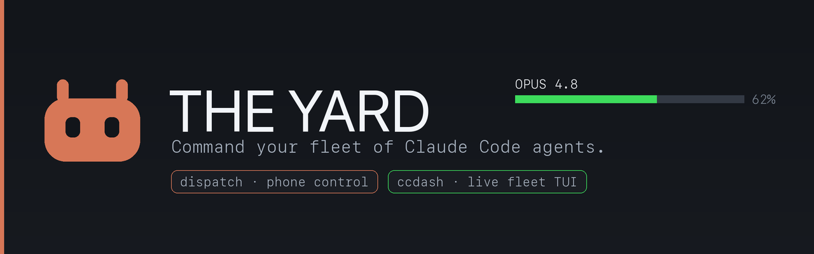
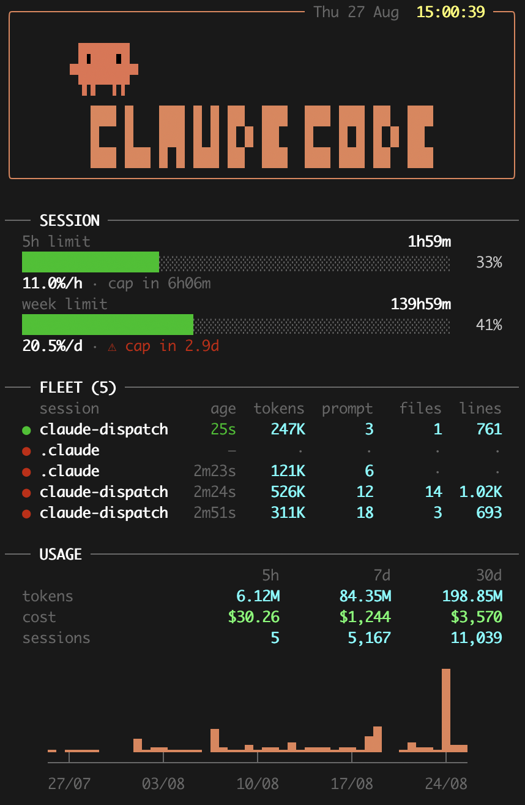
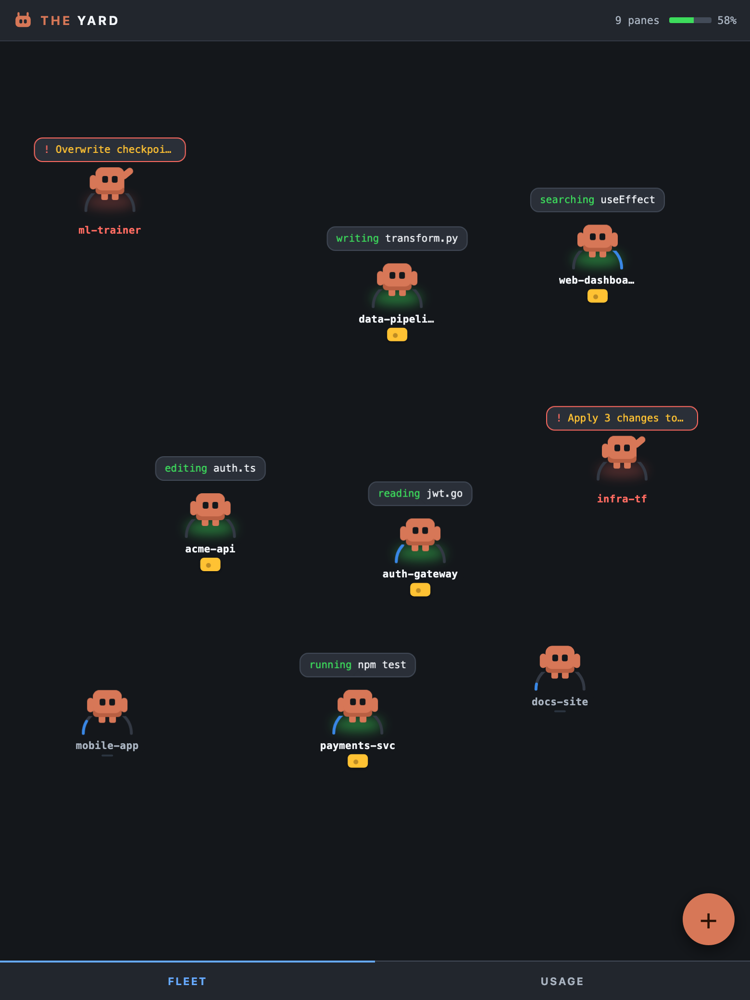

<div align="center">



**Run a fleet of Claude Code agents — and actually stay on top of it.**

Two tools that share one status feed: a live dashboard for the terminal, and a
phone-first control panel for driving every pane from your pocket.

[Quick start](#quick-start) · [ccdash](#ccdash--the-fleet-dashboard) · [dispatch](#cc-dispatch--phone-control) · [Security](#security-model) · [Configuration](#configuration)


</div>

---

## Why

Once you run more than one or two Claude Code sessions at a time, the terminal
stops being enough. You can't tell which pane is working, which is blocked on a
prompt, which one has burned through its context window, or what any of them
cost. And the moment you step away from the keyboard, you lose the fleet
entirely.

**The Yard** is two small, dependency-light tools that fix exactly that:

| | | |
|---|---|---|
| 🖥️ **ccdash** | A live TUI that shows every running session in one window — context fill, token burn, spend, 5h/7d rate-limit bars, and rolling usage history. | *terminal* |
| 📱 **CC Dispatch** | A phone-first web panel that reads and **drives** your existing iTerm2 panes — read output, send input, hit Esc/Enter, spawn a fresh pane — over your private tailnet. | *phone* |

They're glued together by one thing: Claude Code's statusline hook writes a JSON
dump per session to `/tmp/cc-status/`. Both tools read that feed. Nothing
restarts your sessions; nothing runs in the cloud; no keys leave your machine.

---

## Quick start

> **Requires:** macOS + [iTerm2](https://iterm2.com), Python 3.10+, and
> [`jq`](https://jqlang.github.io/jq/). Dispatch also needs
> [Tailscale](https://tailscale.com) to reach your phone safely.

```bash
git clone https://github.com/moosfable/the-yard.git
cd the-yard
./install.sh              # installs both — or: ./install.sh ccdash | dispatch
```

The installer copies the ccdash scripts into `~/.claude`, wires the statusline
into your `settings.json` (backing it up first), and builds a virtualenv for
Dispatch. Then:

```bash
# ccdash — open the dashboard in a fresh iTerm window
bash ~/.claude/cc-dash.sh

# CC Dispatch — start the control server
cd dispatch && ./.venv/bin/python server.py
```

---

## ccdash — the fleet dashboard

<p align="center"></p>

A single live TUI for everything you're running. No third-party dependencies —
just `python3`.

- **FLEET** — one row per live session: model, context-window fill, working
  timer, cost, and the last thing you asked it.
- **Session limit bars** — weighted-token bars calibrated to match Claude Code's
  `/usage` "current session" percentage.
- **USAGE** — live window (exact, from Claude Code) beside rolling 7-day / 30-day
  totals, with a daily-token chart built from your cached transcript history.
- **Window scoping** — launched from `cc-dash.sh`, it scopes the fleet to the
  iTerm window you started from, so each workspace gets its own dashboard.

```bash
bash ~/.claude/cc-dash.sh            # scoped to the current iTerm window
python3 ~/.claude/cc-dashboard.py    # raw — shows all windows
```

## CC Dispatch — phone control

<p align="center"></p>

<p align="center"><sub><em>Phone UI shown with demo data.</em></sub></p>

A web app that reads and drives your **existing** Claude Code panes — from your
phone, on the couch, away from the desk. Every pane is a **clawd** in the yard:
the ring at its feet is context used, the bubble is what it's doing right now,
and a tap opens the session.

- **See the fleet** — every pane, its state, and its live output.
- **Drive it** — send a message, hit Enter/Esc/Ctrl-C, scroll back through
  output, or spawn a brand-new Claude pane in a scratch dir.
- **Nothing is restarted.** Dispatch attaches to sessions that already exist via
  the iTerm2 Python API. Kill the server and your fleet is exactly as it was.
- **Installable as a PWA** — add it to your home screen; it looks and launches
  like a native app, clawd mark and all.

```bash
cd dispatch && ./.venv/bin/python server.py
# serves on 127.0.0.1:8788 by default
```

To reach it from your phone, put it behind your tailnet — never a public port:

```bash
tailscale serve https / http://127.0.0.1:8788
```

Now open `https://<your-machine>.<tailnet>.ts.net` on your phone and register a
passkey.

---

## Security model

Dispatch drives a live terminal, so it's built to be paranoid by default:

1. **Loopback only.** The server binds `127.0.0.1`. It has no listener on any
   network interface — reachability is Tailscale's job, not an open port's.
2. **Passkey-gated writes.** Every write is gated by a WebAuthn passkey (Face ID
   / fingerprint), bound to the tailnet origin, so it's unphishable and the
   private key never leaves your phone.
3. **Send-allow gating.** A pane only accepts keystrokes if it's actually running
   Claude. Scratch shells and unrelated panes are unreachable by construction.
4. **Audit log.** Every authenticated action is written to `audit.log` (git-ignored).

**Never bind Dispatch to a public interface.** The tailnet name over TLS is the
supported path; a bare IP disables passkeys on purpose.

### What is *not* in this repo

The installer and `.gitignore` keep runtime secrets out of version control:
`.credentials.json` (your registered passkeys), `.token`, `audit.log`, and the
`/tmp/cc-status/` feed are all local-only and never committed.

---

## Configuration

**ccdash** (environment variables):

| Var | Default | Meaning |
|---|---|---|
| `CC_SESSION_LIMIT` | `90_000_000` | Weighted-token cap for the session bar — tune to your plan. |
| `CC_WINDOW_HOURS` | `5` | Rolling session window length. |
| `CC_REFRESH` | `0.25` | Redraw interval (seconds). |
| `CC_ITERM_WINDOW` | *current* | iTerm window (`w<N>`) to scope the fleet to. |

**CC Dispatch** (environment variables):

| Var | Default | Meaning |
|---|---|---|
| `DISPATCH_PORT` | `8788` | Server port. |
| `DISPATCH_BIND` | `127.0.0.1` | Bind address — leave it on loopback. |
| `CC_FLEET_DIR` | `/tmp/cc-status` | Where the statusline drops per-session JSON. |

---

## How it fits together

```
   Claude Code panes (iTerm2)
        │  statusline.sh  (hook, per render)
        ▼
   /tmp/cc-status/<session>.json   ← the shared feed
        │                     │
        ▼                     ▼
     ccdash               CC Dispatch ──(iTerm2 API)──► drives the panes
   (read-only TUI)        (read + write, passkey-gated)
```

---

## License

MIT — see [LICENSE](LICENSE). Not affiliated with Anthropic; "Claude" and
"Claude Code" are their marks.
